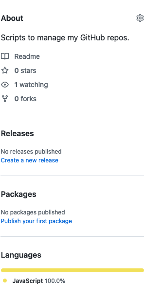
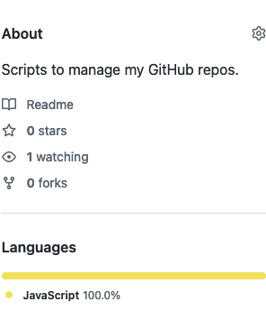

# GitHub scripts

> Scripts to manage my GitHub repos.

## Overview

### Disable wiki and projects

On the vast majority of my projects, I don't use GitHub wikis and
projects, and I like to keep them disabled in the settings to keep
things neat. Since there's no way to configure default repo settings on
GitHub, this script helps me identify the repos where I need to disable
those features.

```sh
GITHUB_TOKEN=your-token-here node audit-wiki-and-projects.js
```

You can get a personal API token [in your developer settings](https://github.com/settings/tokens).

### Disable releases, packages and environment

The other thing I like to disable is the releases, packages and
environment sections on the right of the home page of a repo, because I
don't use those either and it essentially pollutes the section to
display "no releases published" and "no packages published" on all of my
packages.

This is not something we can control with the GitHub API, so I made a
script to be run in the browser on `github.com` to deal with that.

Internally, it uses GitHub's internal
`https://github.com/:user/:repo/settings/update_meta` endpoint to update
the `repo_sections[releases]`, `repo_sections[packages]` and
`repo_sections[environments]` properties.

Just copy the contents of [`audit-meta.js`](audit-meta.js) in the
browser console. The `auditMeta` function needs to be called with a list
of repos to process.

Conveniently, because `audit-wiki-and-projects.js` already knows the
full list of repos of the user, it will output the `auditMeta` call that
can just be pasted in the browser console.

This will disable all those sections on every repo if it's not the case
already.

| Before                | After               |
|-----------------------|---------------------|
|  |  |

Yeah I know, it's kinda overkill to make a script for such nitpicking.
But hey, it's fun, and I have a lot of free time lately. 😜
